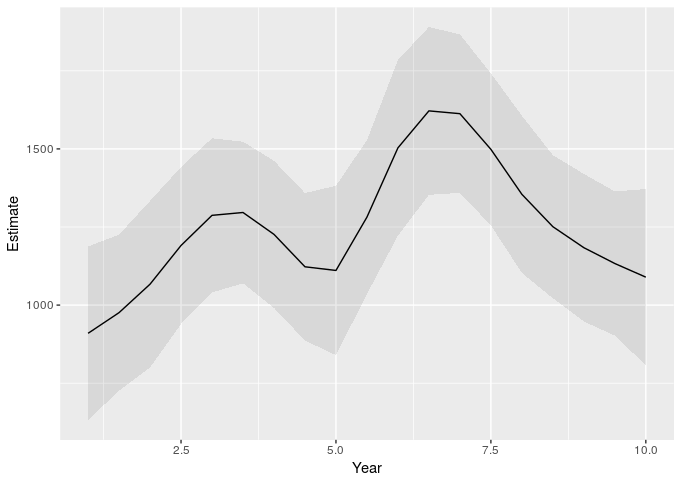
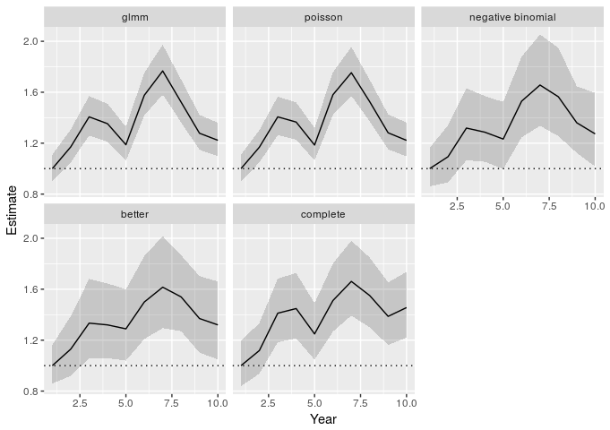
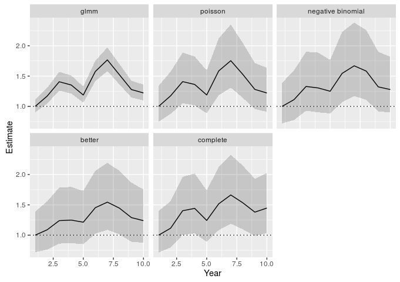

<!-- README.md is generated from README.Rmd. Please edit that file -->
[](http://dx.doi.org/10.5281/zenodo.48423)

| Branch  | Build status                                                                                                                                                                           | Code coverage                                                                                                                                  |
|---------|----------------------------------------------------------------------------------------------------------------------------------------------------------------------------------------|------------------------------------------------------------------------------------------------------------------------------------------------|
| Master  | [](https://app.wercker.com/project/bykey/5f154cd480de20b68cde62705e817436) | [](https://codecov.io/github/inbo/multimput?branch=master)   |
| Develop | [](https://app.wercker.com/project/bykey/5f154cd480de20b68cde62705e817436) | [](https://codecov.io/github/inbo/multimput?branch=develop) |

CAUTION: GitHub flavoured markdown doesn't support the rendering of mathematics at this moment. Hence the mathematics in this README are not rendered properly. The information below is also available as a vignette within the package. The mathematics will be rendered in the vignette. To read the vignette one needs to install the package first.

Installation instructions
=========================

This package requires the `INLA` package. You need to install it with `install.packages("INLA", repos = "https://www.math.ntnu.no/inla/R/stable")`. If this fails you can use `devtools::install_github("inbo/INLA")`. Note that the latter is just a read-only mirror which is infrequently updated. Hence installing `INLA` from <https://www.math.ntnu.no/inla> is highly recommended.

When `INLA` is installed, you can install `multimput` with `devtools::install_github("inbo/multimput", build_vignettes = TRUE)`. To view the vignette use `vignette("Impute", package = "multimput")`

A docker image with all the required dependencies is available from <https://hub.docker.com/r/inbobmk/multimput/>. Use `docker pull inbobmk/multimput` to get it.

The `multimput` package
=======================

The `multimput` package was originally intended to provide the data and code to replicate the results of Onkelinx, Devos, and Quataert (2016). This paper is freely available at <http://dx.doi.org/10.1007/s10336-016-1404-9>. The functions were all rewritten to make them more user-friendly and more generic. In order to make the package more compact, we removed the original code and data starting for version 0.2.6. However both the original code and data remain available in [the older releases](https://github.com/inbo/multimput/releases).

Very short intro to multiple imputation
=======================================

1.  Create the imputation model
2.  Generate imputations for the missing observation
3.  Aggregate the imputed data
4.  Model the aggregated imputed data

Short intro to multiple imputation
==================================

The imputations are based on a model *Y* ∼ *X**β*<sup>\*</sup> which the user has to specify. For a missing value *i* with covariates *x*<sub>*i*</sub>, we draw a random value *y*<sub>*i*</sub> from the distribution of $\\hat{y}\_i$. In case of a linear model, we sample a normal distribution $y\_i \\sim N(\\hat{y}\_i, \\sigma\_i)$. An imputation set *l* holds an impute value *y*<sub>*i*</sub> for each missing value.

With the missing values replaced by imputation set *l*, the dataset is complete. So we can apply the analysis that we wanted to do in the first place. This can, but don't has to, include aggregating the dataset prior to analysis. The analysis results in a set of coefficients *γ*<sub>*a*</sub><sub>*l*</sub> and their standard error *σ*<sub>*a*</sub><sub>*l*</sub>. Of course, this set will depend on the imputed values of the imputation set *l*. Another imputation set has different imputed values and will hence lead to different coefficients.

Therefore the imputation, aggregation and analysis is repeated for *L* different imputation sets, resulting in *L* sets of coefficients and their standard errors. They are aggregated by the formulas below. The coefficient will be the average of the coefficient in all imputation sets. The standard error of a coefficient is the square root of a sum of two parts. The first part is the average of the squared standard error in all imputation sets. The second part is the variance of the coefficient among the imputation sets, multiplied by a correction factor $1 + \\frac{1}{L}$.

$$\\bar{\\gamma}\_a = \\frac{\\sum\_{l = 1}^L{\\gamma\_a}\_l}{L}$$
$$\\bar{\\sigma}\_a = \\sqrt{\\frac{\\sum\_{l = 1}^J {{\\sigma\_a^2}\_l}}{L} + (1 + \\frac{1}{L}) 
\\frac{\\sum\_{l = 1}^L({\\gamma\_a}\_l - \\bar{\\gamma}\_a) ^ 2}{L - 1}}$$

The dataset
===========

First, let's generate a dataset and set some observations missing. `generateData()` creates a balanced dataset with repeated visits of a number of sites. Each site is visited several years and multiple times per year. Have a look at the help-file of `generateData()` for more details on the model.

``` r
library(multimput)
set.seed(123)
prop.missing <- 0.5
dataset <- generateData(
  n.year = 10, n.period = 6, n.site = 50, 
  n.run = 1
)
dataset$Observed <- dataset$Count
which.missing <- sample(nrow(dataset), size = nrow(dataset) * prop.missing)
dataset$Observed[which.missing] <- NA
dataset$fYear <- factor(dataset$Year)
dataset$fPeriod <- factor(dataset$Period)
dataset$fSite <- factor(dataset$Site)
str(dataset)
#> 'data.frame':    3000 obs. of  10 variables:
#>  $ Year    : int  1 2 3 4 5 6 7 8 9 10 ...
#>  $ Period  : int  1 1 1 1 1 1 1 1 1 1 ...
#>  $ Site    : int  1 1 1 1 1 1 1 1 1 1 ...
#>  $ Mu      : num  11.36 9.31 11.33 10.98 9.79 ...
#>  $ Run     : int  1 1 1 1 1 1 1 1 1 1 ...
#>  $ Count   : num  8 2 10 21 2 2 13 8 10 4 ...
#>  $ Observed: num  NA NA 10 21 NA 2 13 8 10 4 ...
#>  $ fYear   : Factor w/ 10 levels "1","2","3","4",..: 1 2 3 4 5 6 7 8 9 10 ...
#>  $ fPeriod : Factor w/ 6 levels "1","2","3","4",..: 1 1 1 1 1 1 1 1 1 1 ...
#>  $ fSite   : Factor w/ 50 levels "1","2","3","4",..: 1 1 1 1 1 1 1 1 1 1 ...
```

Variables in dataset

Year  
The year of the observation as an integer

fYear  
The year of the observation as a factor

Period  
The period of the observation as an integer

fPeriod  
The period of the observation as a factor

Site  
The ID of the site as an integer

fSite  
The ID of the site as a factor

Mu  
The expected value of a negative binomial distribution

Count  
A realisation of a negative binomial distribution with expected value `Mu`

Observed  
The `Count` variable with missing data

``` r
library(ggplot2)
ggplot(dataset, aes(x = Year, y = Mu, group = Site)) + 
  geom_line() + 
  facet_wrap(~Period) + 
  scale_y_log10()
```


Create the imputation model
===========================

We will create several models, mainly to illustrate the capabilities of the `multimput` package. Hence several of the models are not good for a real life application.

``` r
# a simple linear model
imp.lm <- lm(Observed ~ fYear + fPeriod + fSite, data = dataset)
# a mixed model with Poisson distribution
# fYear and fPeriod are the fixed effects
# Site are independent and identically distributed random intercepts
library(lme4)
imp.glmm <- glmer(
  Observed ~ fYear + fPeriod + (1 | fSite), 
  data = dataset, 
  family = poisson
)
library(INLA)
# a mixed model with Poisson distribution
# fYear and fPeriod are the fixed effects
# Site are independent and identically distributed random intercepts
# the same model as imp.glmm
imp.inla.p <- inla(
  Observed ~ fYear + fPeriod + f(Site, model = "iid"), 
  data = dataset, 
  family = "poisson", 
  control.predictor = list(compute = TRUE, link = 1)
)
# the same model as imp.inla.p but with negative binomial distribution
imp.inla.nb <- inla(
  Observed ~ fYear + fPeriod + f(fSite, model = "iid"), 
  data = dataset, 
  family = "nbinomial", 
  control.predictor = list(compute = TRUE, link = 1)
)
# a mixed model with negative binomial distribution
# fPeriod is a fixed effect
# f(Year, model = "rw1") is a global temporal trend 
#     modelled as a first order random walk
#     delta_i = Year_i - Year_{i-1} with delta_i \sim N(0, \sigma_{rw1})
# f(YearCopy, model = "ar1", replicate = Site) is a temporal trend per Site
#     modelled as an first order autoregressive model
#     Year_i_k = \rho Year_{i-1}_k + \epsilon_i_k with \epsilon_i_k \sim N(0, \sigma_{ar1})
dataset$YearCopy <- dataset$Year
imp.better <- inla(
  Observed ~ 
    f(Year, model = "rw1") + 
    f(YearCopy, model = "ar1", replicate = Site) + 
    fPeriod, 
  data = dataset, 
  family = "nbinomial", 
  control.predictor = list(compute = TRUE, link = 1)
)
```

Apply the imputation model
==========================

Most models have a `predict` method. In such a case `impute()` requires both a `model` and a `data` argument. Note that this implies that one can apply an imputation on any dataset as long as the dataset contains the necessary variables.

`inla` do the prediction simultaneously with the model fitting. Hence the model contains all required information and the `data` is not used.

`n.imp` is the number of imputations. The default is `n.imp = 19`.

``` r
raw.lm <- impute(imp.lm, data = dataset)
raw.glmm <- impute(imp.glmm, data = dataset)
raw.inla.p <- impute(imp.inla.p)
raw.inla.nb <- impute(imp.inla.nb)
raw.better <- impute(imp.better)
raw.better.9 <- impute(imp.better, n.imp = 9)
```

Aggregate the imputed dataset
=============================

Suppose that we are interested in the sum of the counts over all sites for each combination of year and period. Then we must aggregate the imputations on year and period. The resulting object will only contain the imputed response and the grouping variables. The easiest way to have a variable like year both a continuous and factor is to add both `Year` and `fYear` to the `grouping`.

``` r
aggr.lm <- aggregate_impute(
  raw.lm, 
  grouping = c("fYear", "fPeriod"), 
  fun = sum
)
aggr.glmm <- aggregate_impute(
  raw.glmm, 
  grouping = c("fYear", "fPeriod"), 
  fun = sum
)
aggr.inla.p <- aggregate_impute(
  raw.inla.p, 
  grouping = c("fYear", "fPeriod"), 
  fun = sum
)
aggr.inla.nb <- aggregate_impute(
  raw.inla.nb, 
  grouping = c("fYear", "fPeriod"), 
  fun = sum
)
aggr.better <- aggregate_impute(
  raw.better, 
  grouping = c("fYear", "fPeriod"), 
  fun = sum
)
aggr.better.9 <- aggregate_impute(
  raw.better.9, 
  grouping = c("fYear", "fPeriod"), 
  fun = sum
)
```

Model the aggregated imputed dataset
====================================

Simple example
--------------

`model_impute()` will apply the `model.fun` to each imputation set. The covariates are defined in the `rhs` argument. So `model.fun = lm` in combination with `rhs = "0 + fYear + fPeriod"` is equivalent to `lm(ImputedResponse ~ 0 + fYear + fPeriod, data = ImputedData)`.

The tricky part of this function the `extractor` argument. This is a user defined function which must have an argument called `model`. The function should return a `data.frame` or `matrix` with two columuns. The first column hold the estimate of a parameter of the `model`, the second column their standard error. Each row represents a parameter.

``` r
extractor.lm <- function(model){
  summary(model)$coefficients[, c("Estimate", "Std. Error")]
}  
model_impute(
  aggr.lm, 
  model.fun = lm, 
  rhs = "0 + fYear + fPeriod", 
  extractor = extractor.lm
)
#> # A tibble: 15 × 5
#>    Parameter  Estimate       SE       LCL       UCL
#>       <fctr>     <dbl>    <dbl>     <dbl>     <dbl>
#> 1     fYear1  915.6794 143.7884  633.8593 1197.4994
#> 2     fYear2 1039.5812 144.8056  755.7674 1323.3950
#> 3     fYear3 1319.8559 137.0545 1051.2339 1588.4778
#> 4     fYear4 1248.5774 136.5014  981.0396 1516.1152
#> 5     fYear5 1034.5023 142.1748  755.8449 1313.1597
#> 6     fYear6 1543.1000 160.2901 1228.9372 1857.2629
#> 7     fYear7 1641.6491 135.1280 1376.8030 1906.4952
#> 8     fYear8 1325.5156 141.3124 1048.5484 1602.4827
#> 9     fYear9 1184.6325 131.2830  927.3226 1441.9425
#> 10   fYear10 1092.5166 146.4315  805.5161 1379.5170
#> 11  fPeriod2  394.9609 136.6279  127.1752  662.7466
#> 12  fPeriod3  536.5071 136.9948  268.0021  805.0120
#> 13  fPeriod4  354.1306 129.3417  100.6254  607.6357
#> 14  fPeriod5 -125.4260 133.4333 -386.9504  136.0985
#> 15  fPeriod6 -421.7390 131.9829 -680.4207 -163.0573
```

Return only the parameters associated with `fYear`
--------------------------------------------------

The `extractor` function requires more work from the user. This cost is compensated by the high degree of flexibility. The user doesn't depend on the predefined extractor functions. This is illustrated by the following examples.

``` r
extractor.lm2 <- function(model){
  cf <- summary(model)$coefficients
  cf[grepl("fYear", rownames(cf)), c("Estimate", "Std. Error")]
}  
model_impute(
  aggr.lm, 
  model.fun = lm, 
  rhs = "0 + fYear + fPeriod", 
  extractor = extractor.lm2
)
#> # A tibble: 10 × 5
#>    Parameter  Estimate       SE       LCL      UCL
#>       <fctr>     <dbl>    <dbl>     <dbl>    <dbl>
#> 1     fYear1  915.6794 143.7884  633.8593 1197.499
#> 2     fYear2 1039.5812 144.8056  755.7674 1323.395
#> 3     fYear3 1319.8559 137.0545 1051.2339 1588.478
#> 4     fYear4 1248.5774 136.5014  981.0396 1516.115
#> 5     fYear5 1034.5023 142.1748  755.8449 1313.160
#> 6     fYear6 1543.1000 160.2901 1228.9372 1857.263
#> 7     fYear7 1641.6491 135.1280 1376.8030 1906.495
#> 8     fYear8 1325.5156 141.3124 1048.5484 1602.483
#> 9     fYear9 1184.6325 131.2830  927.3226 1441.942
#> 10   fYear10 1092.5166 146.4315  805.5161 1379.517
```

Predict a smoother for predefined values
----------------------------------------

Note that we pass extra arguments to the `extractor` function through the `extractor.args` argument. This has to be a list. We recommend to use a named list to avoid confusion.

``` r
library(mgcv)
new.set <- expand.grid(
  Year = pretty(dataset$Year, 20),
  fPeriod = dataset$fPeriod[1]
)
extractor.lm3 <- function(model, newdata){
  predictions <- predict(model, newdata = newdata, se.fit = TRUE)
  cbind(
    predictions$fit,
    predictions$se.fit
  )
}  
model.gam <- model_impute(
  aggr.lm, 
  model.fun = gam, 
  rhs = "s(Year) + fPeriod", 
  extractor = extractor.lm3,
  extractor.args = list(newdata = new.set),
  mutate = list(Year = ~as.integer(levels(fYear))[fYear])
)
model.gam <- cbind(new.set, model.gam)
ggplot(model.gam, aes(x = Year, y = Estimate, ymin = LCL, ymax = UCL)) + 
  geom_ribbon(alpha = 0.1) + 
  geom_line()
```



Compare the results using different imputation models
-----------------------------------------------------

### Modelling aggregated data with `glm.nb`

Suppose that we are interested in a yearly relative index taking into account the average seasonal pattern. With a complete dataset (without missing values) we could model it like the example below: a generalised linear model with negative binomial distribution because we have counts that are likely overdispersed. `fYear` models the yearly index and `fPeriod` the average seasonal pattern. The `0 +` part removes the intercept for the model. This simple trick gives direct estimates for the effect of `fYear`.

Only the effects of `fYear` are needed for the index. Therefore the extractor functions selects only the parameters who's row name contains fYear. In case that we want the first year to be used as a reference (index year 1 = 100%), we can subtract the estimate for this year from all estimates. The result are the indices relative to the first year, but still in the log scale. Note that the estimated index for year 1 will be 0 and *l**o**g*(100%) = 0.

``` r
library(MASS)
aggr.complete <- aggregate(
  dataset[, "Count", drop = FALSE],
  dataset[, c("fYear", "fPeriod")],
  FUN = sum
)
model.complete <- glm.nb(Count ~ 0 + fYear + fPeriod, data = aggr.complete)
summary(model.complete)
#> 
#> Call:
#> glm.nb(formula = Count ~ 0 + fYear + fPeriod, data = aggr.complete, 
#>     init.theta = 31.78765186, link = log)
#> 
#> Deviance Residuals: 
#>      Min        1Q    Median        3Q       Max  
#> -2.71783  -0.47073   0.00869   0.47030   2.62272  
#> 
#> Coefficients:
#>          Estimate Std. Error z value Pr(>|z|)    
#> fYear1    6.72514    0.09016  74.590  < 2e-16 ***
#> fYear2    6.83730    0.09005  75.929  < 2e-16 ***
#> fYear3    7.06993    0.08985  78.684  < 2e-16 ***
#> fYear4    7.09550    0.08983  78.985  < 2e-16 ***
#> fYear5    6.94750    0.08995  77.237  < 2e-16 ***
#> fYear6    7.13813    0.08980  79.487  < 2e-16 ***
#> fYear7    7.23272    0.08974  80.597  < 2e-16 ***
#> fYear8    7.16345    0.08979  79.784  < 2e-16 ***
#> fYear9    7.05221    0.08987  78.475  < 2e-16 ***
#> fYear10   7.10071    0.08983  79.046  < 2e-16 ***
#> fPeriod2  0.36211    0.08027   4.511 6.44e-06 ***
#> fPeriod3  0.41944    0.08024   5.227 1.72e-07 ***
#> fPeriod4  0.34524    0.08027   4.301 1.70e-05 ***
#> fPeriod5 -0.02515    0.08045  -0.313    0.755    
#> fPeriod6 -0.47112    0.08076  -5.833 5.44e-09 ***
#> ---
#> Signif. codes:  0 '***' 0.001 '**' 0.01 '*' 0.05 '.' 0.1 ' ' 1
#> 
#> (Dispersion parameter for Negative Binomial(31.7877) family taken to be 1)
#> 
#>     Null deviance: 541101.695  on 60  degrees of freedom
#> Residual deviance:     60.596  on 45  degrees of freedom
#> AIC: 852.28
#> 
#> Number of Fisher Scoring iterations: 1
#> 
#> 
#>               Theta:  31.79 
#>           Std. Err.:  5.96 
#> 
#>  2 x log-likelihood:  -820.275
extractor.logindex <- function(model){
  coef <- summary(model)$coefficients
  log.index <- coef[grepl("fYear", rownames(coef)), c("Estimate", "Std. Error")]
  log.index[, "Estimate"] <- log.index[, "Estimate"] - log.index["fYear1", "Estimate"]
  log.index
}  
```

Now that we have a relevant model and extractor function, we can apply them to the aggregate imputed datasets.

``` r
model.glmm <- model_impute(
  object = aggr.glmm,
  model.fun = glm.nb,
  rhs = "0 + fYear + fPeriod",
  extractor = extractor.logindex
)
model.p <- model_impute(
  object = aggr.inla.p,
  model.fun = glm.nb,
  rhs = "0 + fYear + fPeriod",
  extractor = extractor.logindex
)
model.nb <- model_impute(
  object = aggr.inla.nb,
  model.fun = glm.nb,
  rhs = "0 + fYear + fPeriod",
  extractor = extractor.logindex
)
model.better <- model_impute(
  object = aggr.better,
  model.fun = glm.nb,
  rhs = "0 + fYear + fPeriod",
  extractor = extractor.logindex
)
model.complete <- extractor.logindex(model.complete)
colnames(model.complete) <- c("Estimate", "SE")
model.complete <- model.complete %>%
  as.data.frame() %>%
  mutate(
    LCL = qnorm(0.025, Estimate, SE),
    UCL = qnorm(0.975, Estimate, SE),
    Parameter = paste0("fYear", sort(unique(dataset$Year)))
  )
covar <- data.frame(
  Year = sort(unique(dataset$Year))
)
# combine all results and add the Year
parameters <- rbind(
  cbind(covar, model.glmm, Model = "glmm"),
  cbind(covar, model.p, Model = "poisson"),
  cbind(covar, model.nb, Model = "negative binomial"),
  cbind(covar, model.better, Model = "better"),
  cbind(covar, model.complete, Model = "complete")
)
# convert estimate and confidence interval to the original scale
parameters[, c("Estimate", "LCL", "UCL")] <- exp(parameters[, c("Estimate", "LCL", "UCL")])
ggplot(parameters, aes(x = Year, y = Estimate, ymin = LCL, ymax = UCL)) + 
  geom_hline(yintercept = 1, linetype = 3) +
  geom_ribbon(alpha = 0.2) + 
  geom_line() + 
  facet_wrap(~Model)
```



### Modelling aggregated data with `inla`

The example below does something similar. Two things are different: 1) instead of `glm.nb` we use `inla` to model the imputed totals. 2) we model the seasonal pattern as a random intercept instead of a fixed effect.

``` r
extractor.inla <- function(model){
  fe <- model$summary.fixed[, c("mean", "sd")]
  log.index <- fe[grepl("fYear", rownames(fe)), ]
  log.index[, "mean"] <- log.index[, "mean"] - log.index["fYear1", "mean"]
  log.index
}
model.p <- model_impute(
  object = aggr.glmm,
  model.fun = inla,
  rhs = "0 + fYear + f(fPeriod, model = 'iid')",
  model.args = list(family = "nbinomial"),
  extractor = extractor.inla
)
model.p <- model_impute(
  object = aggr.inla.p,
  model.fun = inla,
  rhs = "0 + fYear + f(fPeriod, model = 'iid')",
  model.args = list(family = "nbinomial"),
  extractor = extractor.inla
)
model.nb <- model_impute(
  object = aggr.inla.nb,
  model.fun = inla,
  rhs = "0 + fYear + f(fPeriod, model = 'iid')",
  model.args = list(family = "nbinomial"),
  extractor = extractor.inla
)
model.better <- model_impute(
  object = aggr.better,
  model.fun = inla,
  rhs = "0 + fYear + f(fPeriod, model = 'iid')",
  model.args = list(family = "nbinomial"),
  extractor = extractor.inla
)
m.complete <- inla(
  Count ~ 0 + fYear + f(fPeriod, model = "iid"),
  data = aggr.complete,
  family = "nbinomial"
)
model.complete <- extractor.inla(m.complete)
colnames(model.complete) <- c("Estimate", "SE")
model.complete <- model.complete %>%
  as.data.frame() %>%
  mutate(
    LCL = qnorm(0.025, Estimate, SE),
    UCL = qnorm(0.975, Estimate, SE),
    Parameter = paste0("fYear", sort(unique(dataset$Year)))
  )
# combine all results and add the Year
parameters <- rbind(
  cbind(covar, model.glmm, Model = "glmm"),
  cbind(covar, model.p, Model = "poisson"),
  cbind(covar, model.nb, Model = "negative binomial"),
  cbind(covar, model.better, Model = "better"),
  cbind(covar, model.complete, Model = "complete")
)
# convert estimate and confidence interval to the original scale
parameters[, c("Estimate", "LCL", "UCL")] <- exp(parameters[, c("Estimate", "LCL", "UCL")])
ggplot(parameters, aes(x = Year, y = Estimate, ymin = LCL, ymax = UCL)) + 
  geom_hline(yintercept = 1, linetype = 3) + 
  geom_ribbon(alpha = 0.2) + 
  geom_line() + 
  facet_wrap(~Model)
```



References
==========

Onkelinx, Thierry, Koen Devos, and Paul Quataert. 2016. “Working with Population Totals in the Presence of Missing Data Comparing Imputation Methods in Terms of Bias and Precision.” *Journal of Ornithology*, 1–13. doi:[10.1007/s10336-016-1404-9](https://doi.org/10.1007/s10336-016-1404-9).
